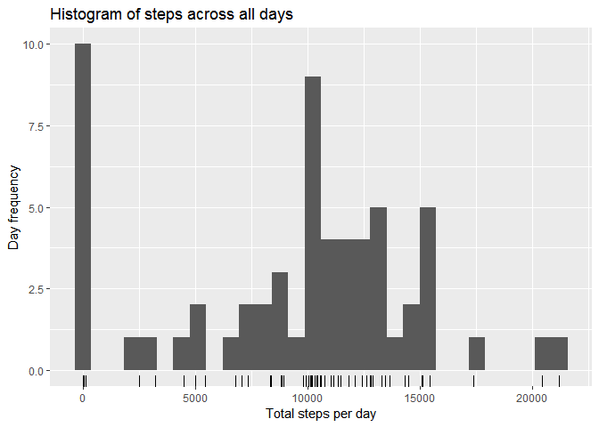
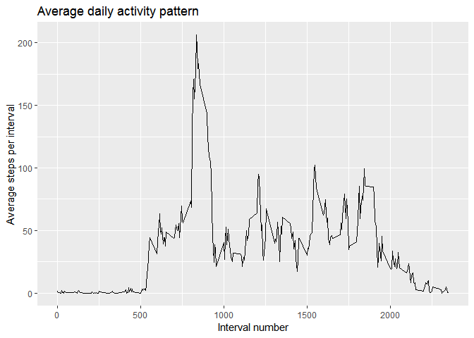
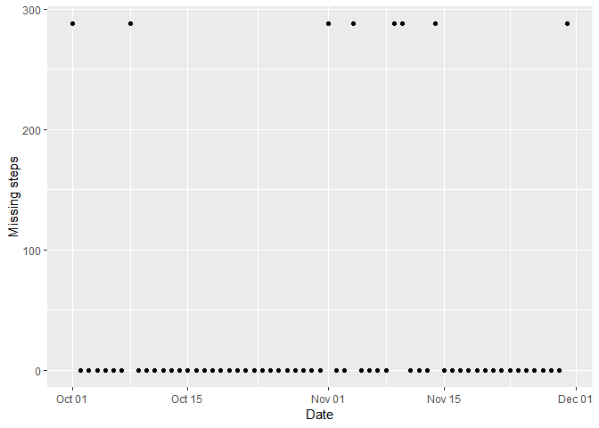
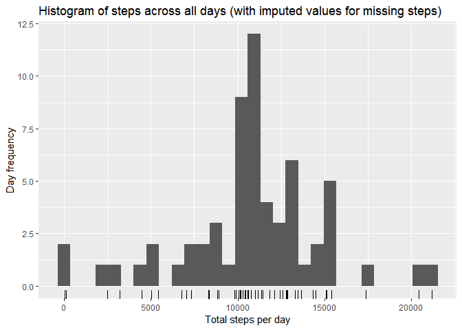
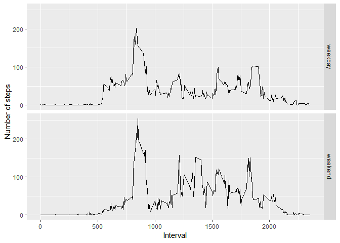

## Loading and preprocessing the data

The activity data is already tidy with each of the variables on a column and each observation on a row. The variables included in this data-set are:

* **steps**: Number of steps taking in a 5-minute interval (missing values are coded as NA)
* **date**: The date on which the measurement was taken in YYYY-MM-DD format
* **interval**: Identifier for the 5-minute interval in which measurement was taken

No further preprocessing is needed apart from loading the variables as the correct types. 


```r
unzip("activity.zip")
act <- read.csv("activity.csv", colClasses = c("integer", "Date", "integer"))
```


## What is the mean total number of steps taken per day?

To explore the data, we first consider the total number of steps taken per day. For these calculations, we ignore the missing steps values. 


```r
library(dplyr)
ds <- act %>% 
  group_by(date) %>% 
  summarise(dailysteps = sum(steps, na.rm = T))
```

Next, we look at the spread of values for total steps per day across all the days via a histogram plot.


```r
library(ggplot2)
qplot(dailysteps, data=ds, xlab = "Total steps per day", ylab = "Day frequency", main= "Histogram of steps across all days") + geom_rug()
```

<!-- -->

We see a spike to the left of the histogram: 10 days fall into the zero steps bin. These are likely caused by the missing values being treated as zero. This will influence the mean and median values of total number of steps taken per day. The **mean** is **9354** while the **median** is **10395**. In a subsequent section we will see how both these values are lower than expected due to being distorted by the missing data.

## What is the average daily activity pattern?
Next we consider the average number of steps taken throughout a typical day. Since the data is divided into 5 minute intervals throughout each day, we plot the average number of steps taken per 5 minute interval (averaged across all days).  

```r
intervalsteps <- act %>% 
  group_by(interval) %>% 
  summarise(steps = mean(steps, na.rm = T))
qplot(interval, steps, data=intervalsteps, geom = "line", ylab = "Average steps per interval", xlab = "Interval number", main = "Average daily activity pattern")
```

<!-- -->

The 5-minute **interval**, on average across all the days in the data-set, that contains the **maximum number of steps** is **835**, which matches the peak in the graph above. 

## Imputing missing values
As noted above, there are 10 days that fall into the zero bin, likely due to missing values. The presence of missing days may introduce bias into some calculations or summaries of the data.

### Total missing values
The total number of **missing values** in the data-set is **2304**. 


### Strategy for filling in missing data
To decide on a strategy for filling in the missing data, lets consider the spread of the missing data. From the histogram we suspect there are 10 days with no or few data, and above we calculated 2304 missing steps in total. Are there any days with partially missing data?


```r
ms <- act %>% 
  group_by(date) %>% 
  summarise(missingsteps = sum(is.na(steps)))
qplot(date, missingsteps, data = ms, xlab = "Date", ylab = "Missing steps")
```

<!-- -->

From this graph we confirm that there are no days with partially missing data. Either all data is missing for a given day, or none is. There are only 8 days with no data. The rug plot beneath the previous histogram confirms that two of the days in the zero bin had non-zero number of total steps.

Therefore a reasonable strategy is to impute the missing values as the average for the same 5-minute interval across all days (excluding missing values).

### Create a new data-set with missing data filled in


```r
# create a vector of indices into the average steps vector
intervalindices <- as.numeric(as.factor(act$interval))  
# create a vector of average steps, the same length as the orginal data
averagesteps_ungrouped <- intervalsteps[intervalindices,"steps"]
# only use the average steps when the actual step value is missing 
imputedsteps <- ifelse(is.na(act$steps), averagesteps_ungrouped$steps, act$steps)
complete <- data.frame(steps = imputedsteps, date = act$date, interval = act$interval)
```
### Revisit histogram with imputed data

We revisit the histogram of total steps taken each day.


```r
ds <- complete %>% 
  group_by(date) %>% 
  summarise(dailysteps = sum(steps, na.rm = T))
qplot(dailysteps, data=ds, xlab = "Total steps per day", ylab = "Day frequency", main= "Histogram of steps across all days (with imputed values for missing steps) ") + geom_rug()
```

<!-- -->

We see the spike to the left of the histogram has been removed, since the 8 days with only missing values have been corrected. There are still two days falling into the left most bin, but the rug plot underneath the histogram confirms that these have valid, non-zero number of steps. The new **mean**,  **10766**, and  **median**,  **10766**, total daily steps are increased compared to previously when missing values were ignored. This is as expected, previously we had whole days of missing data contributing zero steps to the mean and average, resulting in lower values. 


## Are there differences in activity patterns between weekdays and weekends?

### Differentiate weekends and weekdays with a factor variable

In order to investigate the difference between behaviour on weekends and weekdays, we first create a new factor variable in the data-set with two levels – “weekday” and “weekend”.


```r
complete$timeofweek <- as.factor(ifelse(weekdays(complete$date) %in% c("Friday", "Saturday"), "weekend", "weekday"))
```

### Average activity pattern by time of week
Next we plot the average number of steps taken, averaged across all weekday days or weekend days:

```r
towact <- complete %>%
  group_by(interval, timeofweek) %>%
  summarise(avgsteps = mean(steps))
qplot(interval, avgsteps, data=towact, facets = timeofweek~., geom = "line",
      xlab = "Interval", ylab = "Number of steps")
```

<!-- -->

We see that on weekends people first start becoming active later in the day and keep being active until later in the day. This matches our intuition that people sleep later on weekend mornings and go to bed later on weekend evenings. 
